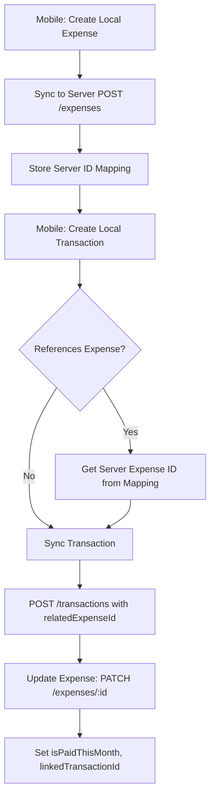

# Mobile App Sync - API Schema & Integration Guide

## Executive Summary

This document provides the **exact** DTO schemas for the failing endpoints, identifies the root causes of validation errors, and explains the ID mapping strategy for mobile-backend synchronization.

---

## 1️⃣ Transaction Creation Endpoint

### Endpoint
```
POST /api/v1/transactions
```

### Complete DTO Schema

Based on [`CreateTransactionDto`](src/transactions/dto/create-transaction.dto.ts:4), here are ALL accepted fields:

```typescript
{
  // REQUIRED FIELDS
  type: TransactionType,           // enum: 'income' | 'expense' | 'card_payment' | 'installment_payment'
  description: string,              // NOT empty
  amount: number,                   // >= 0
  date: string,                     // ISO 8601 date string (e.g., "2025-11-05")
  
  // OPTIONAL FIELDS
  category?: string,                // Free text, used for filtering/grouping
  relatedId?: string,               // UUID - generic relation field
  paymentMethod?: PaymentMethod,    // enum: 'cash' | 'card'
  cardId?: string,                  // UUID - references CreditCard.id
  relatedExpenseId?: string,        // UUID - references Expense.id
  notes?: string                    // Free text notes
}
```

### ❌ Fields That DO NOT Exist (Will Cause Validation Errors)

The following fields **are NOT accepted** and will trigger validation errors:

- ❌ `categoryName` - Does NOT exist
- ❌ `categoryIcon` - Does NOT exist  
- ❌ `categoryColor` - Does NOT exist

### ✅ What You SHOULD Use Instead

The backend only has a single `category` field (string) for transactions. If your mobile app needs to display category names, icons, and colors:

**Option 1: Use the `category` field for category name**
```typescript
{
  category: "Food & Dining",  // Store the category name here
  // Icons and colors should be handled client-side
}
```

**Option 2: Store extra data in `notes` field (JSON)**
```typescript
{
  category: "food",
  notes: JSON.stringify({
    categoryName: "Food & Dining",
    categoryIcon: "🍔",
    categoryColor: "#FF5733",
    userNote: "Lunch with team"
  })
}
```

**Option 3: Create a client-side category mapping**
```typescript
// Mobile app only - not sent to backend
const CATEGORY_METADATA = {
  "food": { name: "Food & Dining", icon: "🍔", color: "#FF5733" },
  "transport": { name: "Transportation", icon: "🚗", color: "#3498DB" },
  // ...
};
```

### Database Schema Reference

From [`schema.prisma`](prisma/schema.prisma:142-172):

```prisma
model Transaction {
  id               String          @id @default(uuid())
  userId           String
  type             TransactionType
  description      String
  amount           Decimal
  date             DateTime        @db.Date
  category         String?         // ✅ Single string field
  relatedId        String?
  paymentMethod    PaymentMethod?
  cardId           String?
  relatedExpenseId String?         // ✅ Links to Expense
  notes            String?
  // ... system fields
}
```

---

## 2️⃣ Expense Update Endpoint

### Endpoint
```
PATCH /api/v1/expenses/:id
```

### Complete Update DTO Schema

Based on [`UpdateExpenseDto`](src/expenses/dto/update-expense.dto.ts:15), here are ALL updatable fields:

```typescript
{
  // ALL FIELDS ARE OPTIONAL FOR PATCH
  name?: string,
  amount?: number,                  // >= 0
  category?: string,                // 'housing' | 'utilities' | 'transportation' | 'food' | 'entertainment' | 'healthcare' | 'debt' | 'savings' | 'other'
  icon?: string,                    // max 10 chars (emoji)
  dueDay?: number,                  // 1-31
  isPaidThisMonth?: boolean,        // ✅ CAN be updated
  lastPaymentDate?: string,         // ✅ CAN be updated (ISO date)
  linkedTransactionId?: string,     // ✅ CAN be updated (UUID)
  isRecurring?: boolean,
  notes?: string                    // max 1000 chars
}
```

### ✅ YES - You CAN Update These Fields

All three fields you asked about **CAN be updated**:

- ✅ `isPaidThisMonth` - Mark expense as paid/unpaid
- ✅ `lastPaymentDate` - Update when it was last paid
- ✅ `linkedTransactionId` - Link to a transaction

### Example Valid Update Request

```json
PATCH /api/v1/expenses/550e8400-e29b-41d4-a716-446655440000

{
  "isPaidThisMonth": true,
  "lastPaymentDate": "2025-11-05",
  "linkedTransactionId": "7c9e6679-7425-40de-944b-e07fc1f90ae7"
}
```

### Database Schema Reference

From [`schema.prisma`](prisma/schema.prisma:79-108):

```prisma
model Expense {
  id                   String    @id @default(uuid())
  userId               String
  name                 String
  amount               Decimal
  category             String    @default("other")
  icon                 String?
  dueDay               Int       @default(15)
  isPaidThisMonth      Boolean   @default(false)      // ✅ Updatable
  lastPaymentDate      DateTime? @db.Date            // ✅ Updatable
  linkedTransactionId  String?                       // ✅ Updatable
  isRecurring          Boolean   @default(true)
  notes                String?
  // ... system fields
}
```

---

## 3️⃣ ID Mapping Strategy

### The Problem

Your error shows:
```
No server ID found for local ID: ed3c9a28-d55e-45a5-9bc5-1ad83ce949f1
```

This happens because the mobile app is trying to reference a local UUID that doesn't exist on the server yet.

### ✅ How Backend Handles IDs

Based on [`expenses.service.ts`](src/expenses/expenses.service.ts:10-19) and [`transactions.service.ts`](src/transactions/transactions.service.ts:10-16):

1. **Backend generates its own UUIDs** when creating records
2. **Client UUIDs are NOT preserved** - the server creates new IDs
3. **The create response returns the server-generated ID**

Example:
```typescript
// Mobile sends
POST /api/v1/expenses
{ name: "Rent", amount: 1000, ... }

// Backend responds with
{
  id: "a1b2c3d4-e5f6-...",  // ← Server-generated UUID
  name: "Rent",
  amount: 1000,
  createdAt: "2025-11-05T12:00:00Z",
  syncVersion: 1,
  ...
}
```

### 🔄 Correct Sync Flow

**Step 1: Create Expense First**
```typescript
// Mobile creates local expense
const localExpense = {
  localId: "ed3c9a28-d55e-45a5-9bc5-1ad83ce949f1",  // Local UUID
  name: "Electricity",
  amount: 150
};

// Sync to server
const response = await POST('/api/v1/expenses', {
  name: localExpense.name,
  amount: localExpense.amount,
  // ... other fields
});

// CRITICAL: Map local ID to server ID
idMapping.set(localExpense.localId, response.id);
// ed3c9a28-... → a1b2c3d4-e5f6-...
```

**Step 2: Create Transaction Referencing Server ID**
```typescript
// Now create transaction that references the expense
const serverExpenseId = idMapping.get("ed3c9a28-...");

await POST('/api/v1/transactions', {
  type: "expense",
  description: "Paid electricity bill",
  amount: 150,
  date: "2025-11-05",
  relatedExpenseId: serverExpenseId,  // ✅ Use server ID
  category: "utilities"
});
```

**Step 3: Update Expense After Payment**
```typescript
// Update expense to mark as paid and link to transaction
await PATCH(`/api/v1/expenses/${serverExpenseId}`, {
  isPaidThisMonth: true,
  lastPaymentDate: "2025-11-05",
  linkedTransactionId: transactionId  // From transaction creation response
});
```

### 📋 Recommended Mobile App ID Mapping

```typescript
interface SyncMapping {
  localId: string;
  serverId: string;
  entityType: 'expense' | 'transaction' | 'creditCard' | 'etc';
  syncedAt: Date;
}

class SyncManager {
  private mappings: Map<string, SyncMapping> = new Map();
  
  async syncExpense(localExpense: LocalExpense) {
    // 1. Create on server
    const serverExpense = await api.post('/expenses', localExpense);
    
    // 2. Store mapping
    this.mappings.set(localExpense.localId, {
      localId: localExpense.localId,
      serverId: serverExpense.id,
      entityType: 'expense',
      syncedAt: new Date()
    });
    
    // 3. Update local DB with server ID
    await db.expenses.update(localExpense.localId, {
      serverId: serverExpense.id,
      synced: true
    });
    
    return serverExpense.id;
  }
  
  getServerId(localId: string): string | undefined {
    return this.mappings.get(localId)?.serverId;
  }
}
```

### ⚠️ Critical Sync Rules

1. **ALWAYS create expenses BEFORE transactions that reference them**
   - Expenses exist independently
   - Transactions can reference expenses via `relatedExpenseId`

2. **NEVER send local UUIDs to the server**
   - Backend generates its own IDs
   - Always use server IDs for references

3. **Store bidirectional mappings**
   - Local ID → Server ID (for creating references)
   - Server ID → Local ID (for updating local records)

4. **Handle sync failures gracefully**
   ```typescript
   try {
     const serverId = await syncExpense(localExpense);
   } catch (error) {
     // Mark as pending sync, retry later
     await db.expenses.update(localExpense.localId, {
       syncStatus: 'pending',
       lastSyncError: error.message
     });
   }
   ```

---

## 🐛 Root Cause Analysis of Current Errors

### Error 1: Category Field Validation
```
property categoryName should not exist
property categoryIcon should not exist
property categoryColor should not exist
```

**Cause:** Mobile app is sending fields that don't exist in [`CreateTransactionDto`](src/transactions/dto/create-transaction.dto.ts:1)

**Fix:** Remove these fields from transaction payloads. Use only `category` (string).

### Error 2: Missing Server ID
```
No server ID found for local ID: ed3c9a28-d55e-45a5-9bc5-1ad83ce949f1
```

**Cause:** Mobile app is trying to:
1. Reference an expense that hasn't been synced yet, OR
2. Using a local UUID instead of the server-generated UUID

**Fix:** 
1. Sync expenses FIRST
2. Store the server ID from the response
3. Use server ID in subsequent references

---

## ✅ Correct Sync Order



---

## 📝 Quick Reference

### Transaction Creation - Valid Example
```json
POST /api/v1/transactions
{
  "type": "expense",
  "description": "Grocery shopping",
  "amount": 75.50,
  "date": "2025-11-05",
  "category": "food",
  "paymentMethod": "card",
  "cardId": "550e8400-e29b-41d4-a716-446655440000",
  "notes": "Weekly groceries"
}
```

### Expense Update - Valid Example
```json
PATCH /api/v1/expenses/a1b2c3d4-e5f6-7890-abcd-1234567890ab
{
  "isPaidThisMonth": true,
  "lastPaymentDate": "2025-11-05",
  "linkedTransactionId": "7c9e6679-7425-40de-944b-e07fc1f90ae7"
}
```

### ID Mapping Example
```typescript
// After creating expense
const expenseResponse = await POST('/expenses', {...});
// expenseResponse.id = "a1b2c3d4-..." (server ID)

// Store mapping
localToServerMap.set("ed3c9a28-...", "a1b2c3d4-...");

// Later, when creating transaction
const serverId = localToServerMap.get("ed3c9a28-...");
await POST('/transactions', {
  relatedExpenseId: serverId  // ✅ Use server ID
});
```

---

## 🔧 Recommended Mobile App Changes

1. **Remove invalid transaction fields:**
   - Delete `categoryName`, `categoryIcon`, `categoryColor` from transaction DTOs
   - Use only `category` field

2. **Implement ID mapping:**
   - Create `SyncMapping` table in local DB
   - Store `localId → serverId` mappings
   - Always resolve to server IDs before API calls

3. **Fix sync order:**
   - Sync expenses BEFORE transactions
   - Wait for expense creation response
   - Use returned server ID in transaction

4. **Handle offline scenarios:**
   - Queue sync operations
   - Retry failed syncs
   - Maintain sync status per record

---

**Generated:** 2025-11-05
**Backend Version:** Based on current NestJS implementation
**Contact:** See BACKEND_STATUS_SUMMARY.md for more details